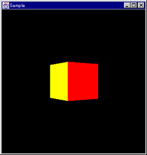

# Magellan for Java

## Introduction

This package is a development package for Java to use Logitech Magellan (Space Mouse) on Java platforms. Please chceck [the download site](https://sourceforge.net/projects/cgvrdrvmagjava/files/) on SourceForge.net to get the package and the samples.


## Setup

To use the package, you have to install latest Java Communications API.
You can get the packages from Sun’s Java site.

## Class Overview

### Magellan Class

```
public class Magellan {
  public Magellan(int device);
  public void start();
  public void stop();
  public void getTranslation(int trans[3]);
  public void getRotation(int rot[3]);
  public void getButtons();
}
```

#### Magellan(int device)

This constructor creates an instance that is used to communicate with a Magellam device. Specify a number of the serial port into the device argument. You can use the platform independent defines Magellan.SERIAL1 or Magellan.SERIAL2.

#### void start()

This method starts a thread that updates the sensor records. To get the valid records by getTranslation(), getRotation() and getButton(), you have to call the methods after you starts the thread using this method.

#### void stop()

This method stops a thread that is started by start().

#### void getTranslation(int trans[3])

This method retrieves a current translation infomation.

#### void getRotation(int rot[3])

This method retrieves a current rotation infomation.

#### int getButtons()

This method retruns a current button infomation. Use the following constants are defined in the class to determine whether the buttons are currently pressd.

CONSTANT | VALUE
---|---
Magellan.BUTTON1 | 0x0001
Magellan.BUTTON2 | 0x0002
Magellan.BUTTON3 | 0x0004
Magellan.BUTTON4 | 0x0008
Magellan.BUTTON5 | 0x0010
Magellan.BUTTON6 | 0x0020
Magellan.BUTTON7 | 0x0040
Magellan.BUTTON8 | 0x0080
Magellan.BUTTONA | 0x0100

For example, If you want to know whether the button1 is currently pressed ....

```
Magellan magellan = new Magellan( .... );
int button = magellan.getButtons();
if ((button & Magellan.BUTTON1) != 0)
    ........
```

### Sample

#### Input Device Driver for Java3D

This is a simple input device driver for Java3D using the Magellan
driver, and you can walk in the world using Magellan. When the asterisk
are pressed, your viewpoint is reseted.



### Revision

Revision | Date | Note
---|---|---
1.0 | 1999/05/20 | The first release.

### License

This package is provided "AS IS". Licenser disclaims all warranties,
including but not limited to, all express or implied warranties of
merchant ability and fitness for a particular purpose. Everyone can use
the package for commerce or personal purposes free.
